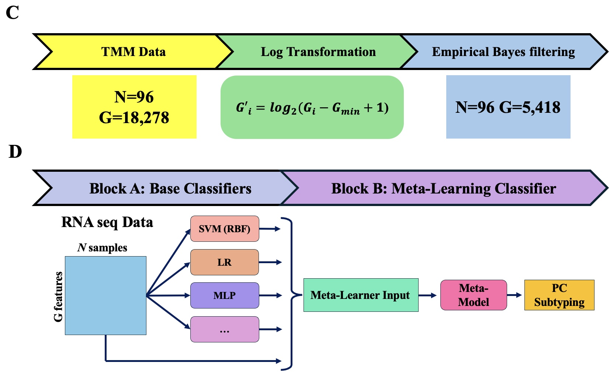
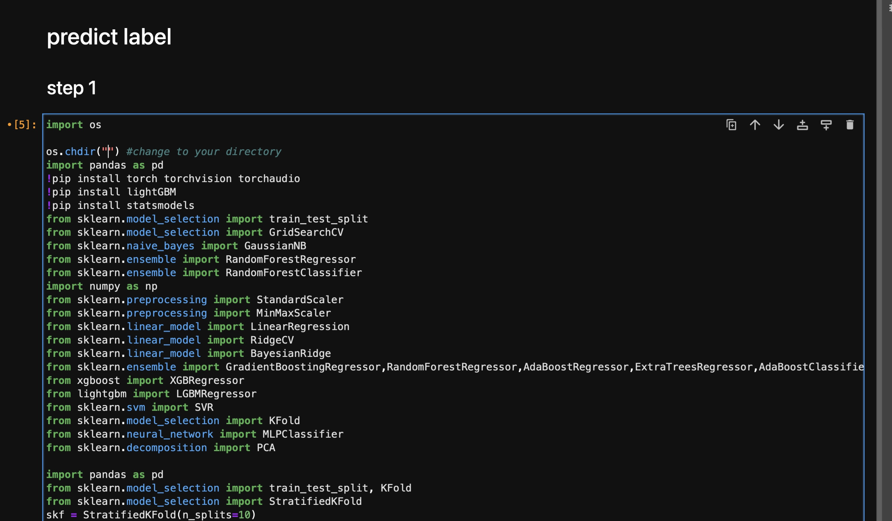
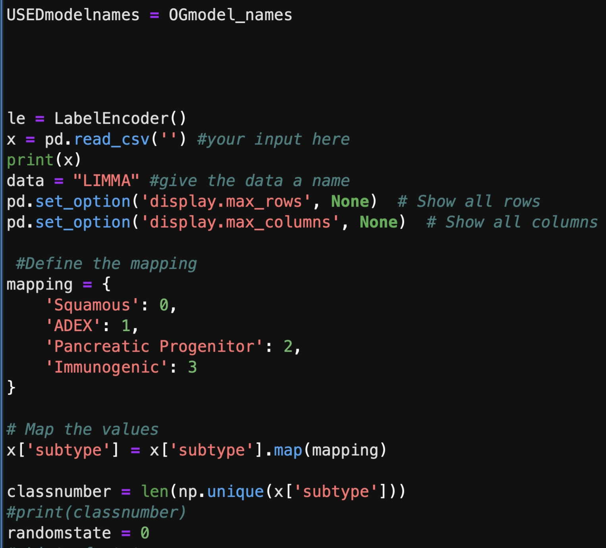
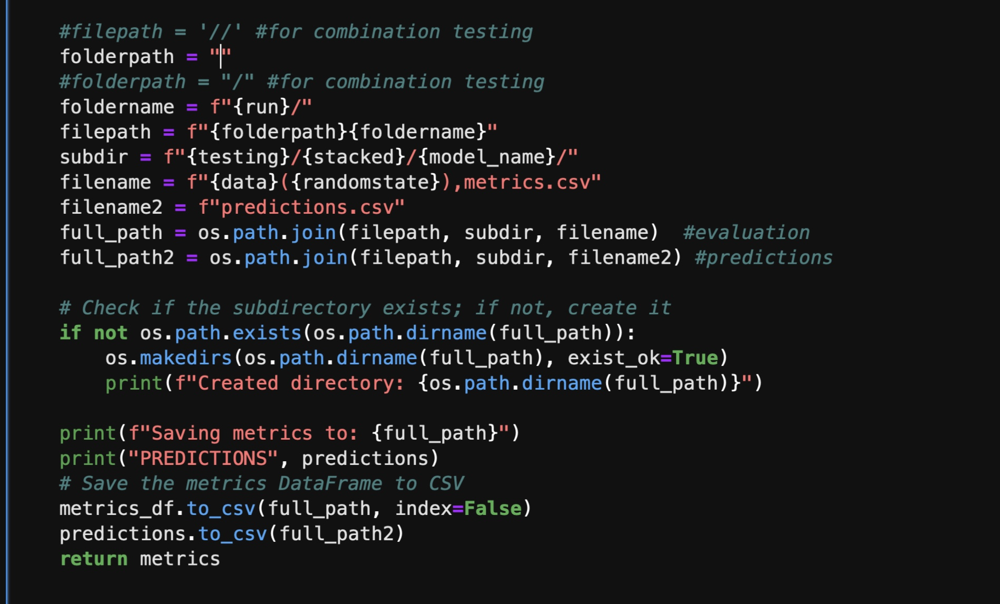
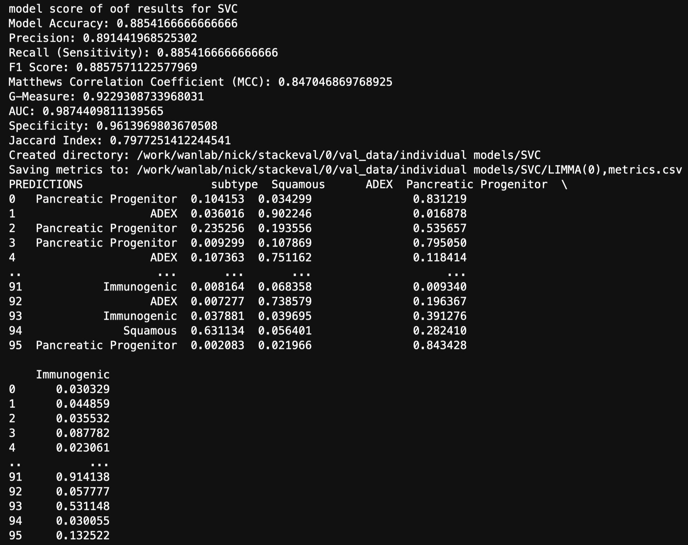

# MetaPaCS: A Novel <ins>Meta</ins>-learning Model for <ins>Pa</ins>ncreatic <ins>C</ins>ancer <ins>S</ins>ubtype Prediction 
**MetaPaCS** (an Ensemble stacking-Based Model for Identifying Pancreatic Cancer Subtypes), is an accurate and cost-effective model for Pancreatic Cancer subtype prediction based on RNA-seq Expression data only. Leveraging multiple different machine learning techniques, MetaPaCS is able to identify accurately and efficiently predict 4 different Pcancreatic Cancer subtypes, which may provide insights into the characteristics of these subtypes that can significantly aid clinical decision-making processes.

## Flowchart of MetaPaCS


## Table of Contents
- [Installation](#installation)
- [Tutorials](#Tutorials)
- [Bug Report](#Bug-Report)
- [Authors](#Authors)
- [Publication](#Publication)

## Tutorials
### Jupyter notebook
1. Download MetaPaCS and LIMMAdata.csv from the github
2. Open the MetaPaCS code in jupyter notebook
3. Specify the current directory, put LIMMAdata.csv or your input data in this directory
   
4. Put LIMMAdata.csv (test data) or your own input data (must be structured as below) in this directory
   
5. Specify the target directory for the output in the evaluation area of the code
6. Enter in the name of your input in block 4, run the code in the order of the block
## Optional
1. Use the other blocks of part 4 to measure performance of all possible unique combinations of 2 or 4 base classifiers
2. Change the configuration of the code to work for the combination blocks by removing the hashtags from the path below to open the alternate output path
   
   
   
```


```
## Example Output

The prediction results and evaluations will be stored and exported to a folder named stackeval (10 classifiers LOO) in your specified directory.
Evaluations are saved for all base and meta-learning classifiers.



## Bug Report

If you find any bugs or problems, or you have any comments on S, please don't hesitate to contact via email nickpeterson@unmc.edu or [Issues](https://github.com/wan-mlab/MetaPaCS/issues).

## Authors
Mengtao Sun, Nick Peterson, Shibiao Wan, Xinchao Wu

## Publication
MetaPaCS: A novel meta-learning model for pancreatic cancer subtype prediction
Nick Peterson, Mengtao Sun, Xinchao Wu, Jieqiong Wang, Shibiao Wan
bioRxiv TBD; doi: TBD

## License 

[](https://www.gnu.org/licenses/gpl-3.0)

GNU GENERAL PUBLIC LICENSE  
Version 3, 29 June 2007

This program is free software: you can redistribute it and/or modify
it under the terms of the GNU General Public License as published by
the Free Software Foundation, either version 3 of the License, or
(at your option) any later version.

This program is distributed in the hope that it will be useful,
but WITHOUT ANY WARRANTY; without even the implied warranty of
MERCHANTABILITY or FITNESS FOR A PARTICULAR PURPOSE.  See the
GNU General Public License for more details.

You should have received a copy of the GNU General Public License
along with this program.  If not, see <https://www.gnu.org/licenses/>.
